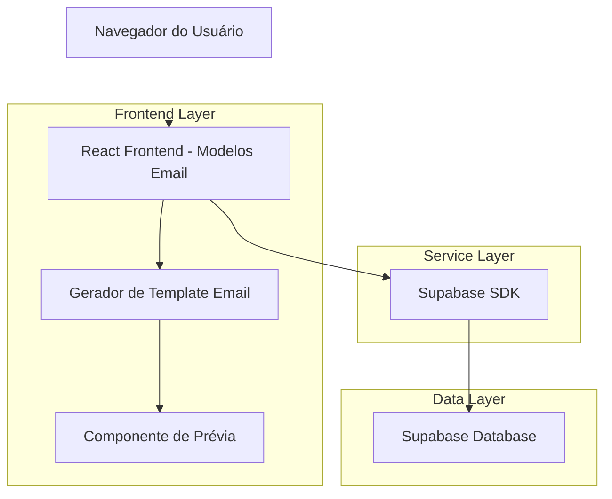
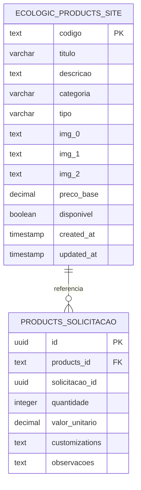

# Arquitetura Técnica - Sistema de Prévia de Email por Código de Produto

## 1. Arquitetura do Sistema



## 2. Descrição das Tecnologias

* **Frontend**: React\@18 + TypeScript + TailwindCSS\@3 + Vite

* **Backend**: Supabase (PostgreSQL + Auth + Real-time)

* **Geração de Email**: Função utilitária JavaScript para HTML

* **Ícones**: Lucide React

* **Estilização**: TailwindCSS com componentes customizados

## 3. Definições de Rotas

| Rota                            | Propósito                                                                   |
| ------------------------------- | --------------------------------------------------------------------------- |
| /modelos-email                  | Página principal de modelos de email com funcionalidade de busca por código |
| /modelos-email?produto={codigo} | Página de modelos com produto pré-carregado via query parameter             |

## 4. Definições de API (Supabase)

### 4.1 Consultas de Banco de Dados

**Busca de produto por código**

```typescript
// Busca na tabela ecologic_products_site
const { data, error } = await supabase
  .from('ecologic_products_site')
  .select(`
    id,
    titulo,
    descricao,
    categoria,
    codigo,
    tipo,
    img_0,
    img_1,
    img_2,
    preco_base,
    disponivel
  `)
  .eq('codigo', productCode)
  .single();
```

**Tipos TypeScript para Produto**

```typescript
interface ProductData {
  id: string;
  titulo: string;
  descricao: string;
  categoria: string;
  codigo: string;
  tipo?: string;
  img_0?: string;
  img_1?: string;
  img_2?: string;
  preco_base?: number;
  disponivel?: boolean;
}

interface EmailPreviewData {
  produto: ProductData;
  orcamento: {
    id: number;
    opcao_frete: string;
    validade_proposta: string;
    prazo_entrega: string;
    forma_pagamento: string;
    observacoes: string;
  };
  cliente: {
    nome: string;
    email: string;
    telefone: string;
    empresa: string;
  };
  consultor: {
    nome: string;
    email: string;
    telefone: string;
  };
  customMessage: string;
}
```

### 4.2 Funções de Geração de Email

**Geração de template com produto específico**

```typescript
// Função para gerar email com produto específico
const generateProductEmailPreview = (productData: ProductData): string => {
  const mockData: EmailPreviewData = {
    produto: productData,
    orcamento: {
      id: 999,
      opcao_frete: 'Frete CIF - Incluso para Grande Vitória',
      validade_proposta: '15',
      prazo_entrega: '10',
      forma_pagamento: 'À vista ou parcelado',
      observacoes: 'Produto sujeito à disponibilidade de estoque'
    },
    cliente: {
      nome: 'Cliente Exemplo',
      email: 'cliente@exemplo.com',
      telefone: '(27) 99999-9999',
      empresa: 'Empresa Exemplo Ltda'
    },
    consultor: {
      nome: 'Consultor Natureza Brindes',
      email: 'consultor@naturezabrindes.com',
      telefone: '(27) 3238-9726'
    },
    customMessage: `Confira nossa proposta para o produto ${productData.titulo}. Estamos à disposição para esclarecer dúvidas.`
  };
  
  return generateOrcamentoEmailHTML(mockData);
};
```

## 5. Modelo de Dados

### 5.1 Definição do Modelo de Dados



### 5.2 Linguagem de Definição de Dados (DDL)

**Tabela principal de produtos (já existente)**

```sql
-- Tabela ecologic_products_site (existente)
-- Campos relevantes para a funcionalidade:
-- codigo (text) - Código único do produto
-- titulo (varchar) - Nome do produto
-- descricao (text) - Descrição detalhada
-- categoria (varchar) - Categoria do produto
-- img_0, img_1, img_2 (text) - URLs das imagens
-- preco_base (decimal) - Preço base do produto
-- disponivel (boolean) - Status de disponibilidade

-- Políticas de acesso (já configuradas)
GRANT SELECT ON ecologic_products_site TO anon;
GRANT SELECT ON ecologic_products_site TO authenticated;

-- Índices para otimização de busca
CREATE INDEX IF NOT EXISTS idx_ecologic_products_codigo 
ON ecologic_products_site(codigo);

CREATE INDEX IF NOT EXISTS idx_ecologic_products_titulo 
ON ecologic_products_site(titulo);

CREATE INDEX IF NOT EXISTS idx_ecologic_products_categoria 
ON ecologic_products_site(categoria);
```

**Dados de exemplo para teste**

```sql
-- Inserir produto de exemplo para testes (se não existir)
INSERT INTO ecologic_products_site (
    codigo, 
    titulo, 
    descricao, 
    categoria, 
    img_0, 
    preco_base, 
    disponivel
) VALUES (
    '53791',
    '5 blocos adesivados com 200 folhas em cartão',
    'Bloco de anotações personalizado com 200 folhas em papel cartão de alta qualidade',
    'Papelaria',
    'https://exemplo.com/imagem-bloco.jpg',
    25.50,
    true
) ON CONFLICT (codigo) DO NOTHING;
```

## 6. Componentes React

### 6.1 Estrutura de Componentes

```typescript
// Componente principal
interface ModelosEmailProps {}

// Hook customizado para busca de produtos
interface UseProductSearchReturn {
  searchProduct: (code: string) => Promise<ProductData | null>;
  loading: boolean;
  error: string | null;
  clearError: () => void;
}

// Componente de busca
interface ProductSearchProps {
  onProductFound: (product: ProductData) => void;
  onError: (error: string) => void;
}

// Componente de prévia
interface EmailPreviewProps {
  product: ProductData;
  htmlContent: string;
  onCopy: () => void;
  onDownload: () => void;
}
```

### 6.2 Fluxo de Estados

```typescript
// Estados principais do componente
interface ModelosEmailState {
  selectedProduct: ProductData | null;
  emailHtml: string;
  searchLoading: boolean;
  searchError: string | null;
  viewMode: 'preview' | 'code';
  recentSearches: ProductData[];
}
```

