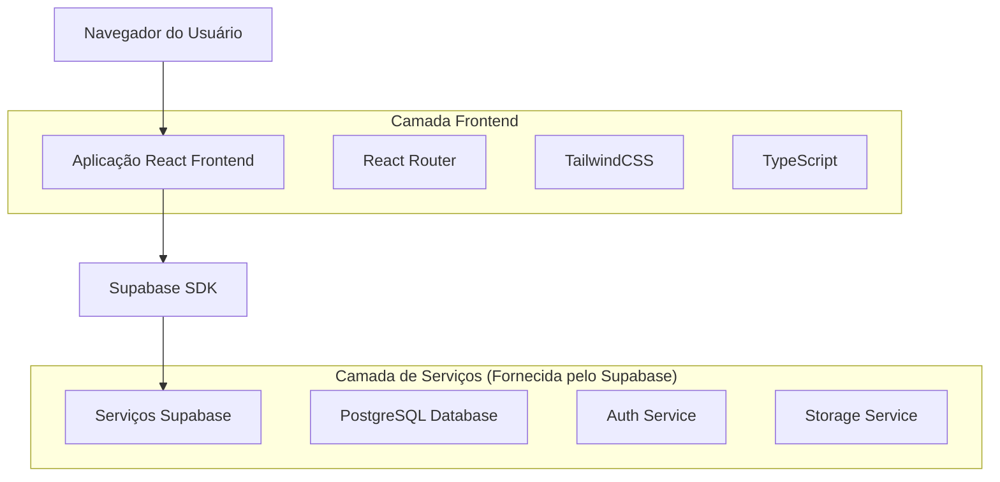
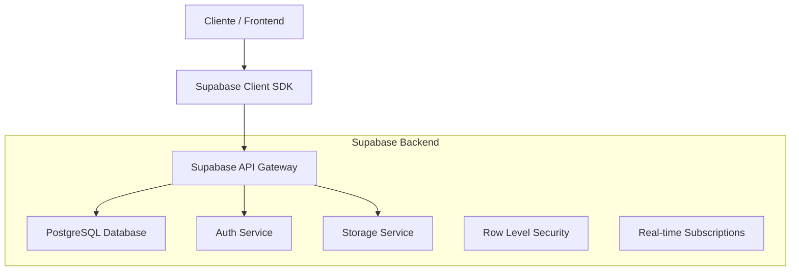
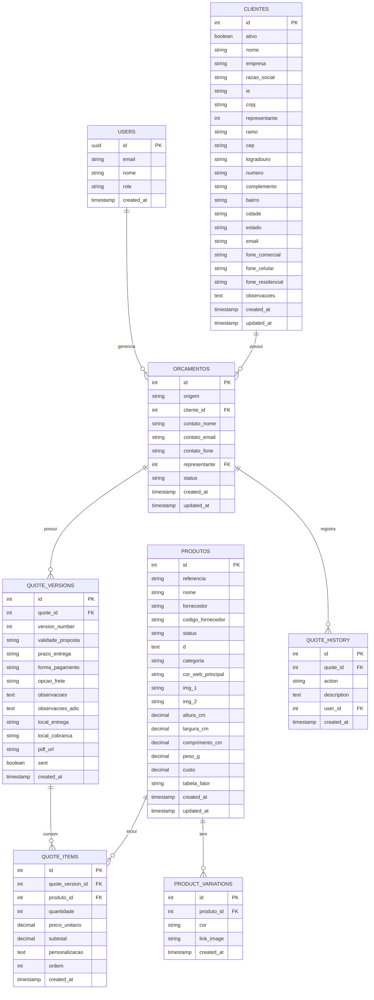

# Documento de Arquitetura Técnica - Admin Brindes

## 1. Design da Arquitetura



## 2. Descrição das Tecnologias

* **Frontend**: React\@18 + TypeScript\@5 + TailwindCSS\@3 + React Router\@6 + Vite\@5

* **Backend**: Supabase (PostgreSQL + Auth + Storage)

* **Bibliotecas adicionais**: @supabase/supabase-js, react-hook-form, react-query, heroicons

## 3. Definições de Rotas

| Rota             | Propósito                                              |
| ---------------- | ------------------------------------------------------ |
| /                | Dashboard principal com visão geral e estatísticas     |
| /clientes        | Lista de clientes com busca e paginação                |
| /clientes/novo   | Formulário para cadastro de novo cliente               |
| /clientes/:id    | Formulário para edição de cliente existente            |
| /produtos        | Lista de produtos com busca, paginação e edição inline |
| /produtos/novo   | Formulário para cadastro de novo produto               |
| /produtos/:id    | Formulário para edição de produto existente            |
| /orcamentos      | Lista de orçamentos com busca e paginação              |
| /orcamentos/novo | Fluxo de criação de novo orçamento                     |
| /orcamentos/:id  | Detalhes completos do orçamento com itens e versões    |
| /login           | Página de autenticação do usuário                      |

## 4. Definições de API

### 4.1 APIs Principais

**Autenticação de usuários**

```typescript
// Supabase Auth - Login
supabase.auth.signInWithPassword({
  email: string,
  password: string
})
```

**Gestão de Clientes**

```typescript
// Listar clientes
GET /rest/v1/clientes
```

Request:

| Nome do Parâmetro | Tipo   | Obrigatório | Descrição                            |
| ----------------- | ------ | ----------- | ------------------------------------ |
| search            | string | false       | Termo de busca para filtrar clientes |
| page              | number | false       | Número da página para paginação      |
| limit             | number | false       | Quantidade de registros por página   |

Response:

| Nome do Parâmetro | Tipo       | Descrição                |
| ----------------- | ---------- | ------------------------ |
| data              | Cliente\[] | Array de objetos cliente |
| count             | number     | Total de registros       |

**Gestão de Produtos**

```typescript
// Atualizar custo/fator inline
PATCH /rest/v1/produtos
```

Request:

| Nome do Parâmetro | Tipo   | Obrigatório | Descrição            |
| ----------------- | ------ | ----------- | -------------------- |
| id                | number | true        | ID do produto        |
| custo             | number | false       | Novo valor do custo  |
| tabela\_fator     | string | false       | Nova tabela de fator |

**Gestão de Orçamentos**

```typescript
// Criar nova versão de orçamento
POST /rest/v1/quote_versions
```

Request:

| Nome do Parâmetro | Tipo         | Obrigatório | Descrição            |
| ----------------- | ------------ | ----------- | -------------------- |
| quote\_id         | number       | true        | ID do orçamento pai  |
| version\_number   | number       | true        | Número da versão     |
| items             | QuoteItem\[] | true        | Itens da nova versão |

Exemplo:

```json
{
  "quote_id": 3966,
  "version_number": 2,
  "items": [
    {
      "produto_id": 1234,
      "quantidade": 100,
      "preco_unitario": 7.12,
      "personalizacao": "Silk 4 cores"
    }
  ]
}
```

## 5. Diagrama da Arquitetura do Servidor



## 6. Modelo de Dados

### 6.1 Definição do Modelo de Dados



### 6.2 Linguagem de Definição de Dados

**Tabela de Clientes (clientes)**

```sql
-- Tabela já existe no Supabase, configurar apenas permissões
GRANT SELECT ON clientes TO anon;
GRANT ALL PRIVILEGES ON clientes TO authenticated;

-- Índices para otimização
CREATE INDEX IF NOT EXISTS idx_clientes_nome ON clientes(nome);
CREATE INDEX IF NOT EXISTS idx_clientes_empresa ON clientes(empresa);
CREATE INDEX IF NOT EXISTS idx_clientes_representante ON clientes(representante);
```

**Tabela de Produtos (produtos)**

```sql
-- Tabela já existe no Supabase, configurar apenas permissões
GRANT SELECT ON produtos TO anon;
GRANT ALL PRIVILEGES ON produtos TO authenticated;

-- Índices para otimização
CREATE INDEX IF NOT EXISTS idx_produtos_referencia ON produtos(referencia);
CREATE INDEX IF NOT EXISTS idx_produtos_nome ON produtos(nome);
CREATE INDEX IF NOT EXISTS idx_produtos_fornecedor ON produtos(fornecedor);
CREATE INDEX IF NOT EXISTS idx_produtos_status ON produtos(status);
```

**Tabela de Variações de Produtos (product\_variations)**

```sql
-- Tabela já existe no Supabase, configurar apenas permissões
GRANT SELECT ON product_variations TO anon;
GRANT ALL PRIVILEGES ON product_variations TO authenticated;

-- Índices para otimização
CREATE INDEX IF NOT EXISTS idx_product_variations_produto_id ON product_variations(produto_id);
```

**Tabela de Orçamentos (orcamentos)**

```sql
-- Tabela já existe no Supabase, configurar apenas permissões
GRANT SELECT ON orcamentos TO anon;
GRANT ALL PRIVILEGES ON orcamentos TO authenticated;

-- Índices para otimização
CREATE INDEX IF NOT EXISTS idx_orcamentos_cliente_id ON orcamentos(cliente_id);
CREATE INDEX IF NOT EXISTS idx_orcamentos_representante ON orcamentos(representante);
CREATE INDEX IF NOT EXISTS idx_orcamentos_status ON orcamentos(status);
CREATE INDEX IF NOT EXISTS idx_orcamentos_created_at ON orcamentos(created_at DESC);
```

**Tabela de Versões de Orçamento (quote\_versions)**

```sql
-- Tabela já existe no Supabase, configurar apenas permissões
GRANT SELECT ON quote_versions TO anon;
GRANT ALL PRIVILEGES ON quote_versions TO authenticated;

-- Índices para otimização
CREATE INDEX IF NOT EXISTS idx_quote_versions_quote_id ON quote_versions(quote_id);
CREATE INDEX IF NOT EXISTS idx_quote_versions_version_number ON quote_versions(quote_id, version_number);
```

**Tabela de Itens de Orçamento (quote\_items)**

```sql
-- Tabela já existe no Supabase, configurar apenas permissões
GRANT SELECT ON quote_items TO anon;
GRANT ALL PRIVILEGES ON quote_items TO authenticated;

-- Índices para otimização
CREATE INDEX IF NOT EXISTS idx_quote_items_quote_version_id ON quote_items(quote_version_id);
CREATE INDEX IF NOT EXISTS idx_quote_items_produto_id ON quote_items(produto_id);
CREATE INDEX IF NOT EXISTS idx_quote_items_ordem ON quote_items(quote_version_id, ordem);
```

**Tabela de Histórico de Orçamentos (quote\_history)**

```sql
-- Tabela já existe no Supabase, configurar apenas permissões
GRANT SELECT ON quote_history TO anon;
GRANT ALL PRIVILEGES ON quote_history TO authenticated;

-- Índices para otimização
CREATE INDEX IF NOT EXISTS idx_quote_history_quote_id ON quote_history(quote_id);
CREATE INDEX IF NOT EXISTS idx_quote_history_created_at ON quote_history(created_at DESC);
```

