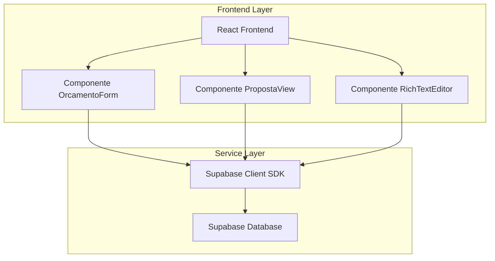
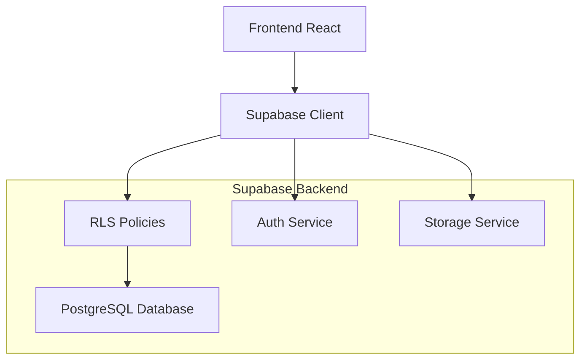
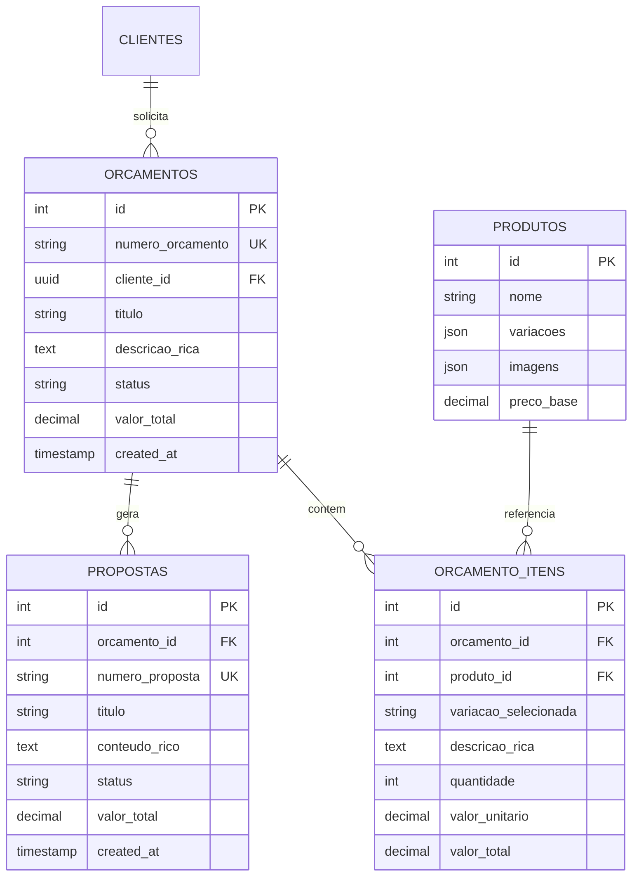

# Arquitetura Técnica - Melhorias do Sistema de Orçamentos

## 1. Arquitetura do Sistema



## 2. Descrição das Tecnologias

- Frontend: React@18 + TypeScript + TailwindCSS@3 + Vite
- Editor Rico: @tiptap/react + @tiptap/starter-kit
- Backend: Supabase (PostgreSQL + Auth + RLS)
- Validação: Zod para validação de dados
- UI Components: Heroicons para ícones

## 3. Definições de Rotas

| Rota | Propósito |
|------|-----------|
| /orcamento/:id | Formulário de orçamento aprimorado com editor rico e seleção correta de variações |
| /proposta/:id | Visualização de proposta com fluxo de criação simplificado |
| /orcamento-detalhes/:id | Detalhes do orçamento com numeração única e gestão simplificada |

## 4. Definições de API

### 4.1 APIs Principais

**Busca de Variações de Produto**
```
GET /api/produtos/:id/variacoes
```

Request:
| Nome do Parâmetro | Tipo | Obrigatório | Descrição |
|-------------------|------|-------------|-----------|
| id | number | true | ID do produto |

Response:
| Nome do Parâmetro | Tipo | Descrição |
|-------------------|------|-----------|
| variacoes | array | Lista de variações disponíveis |
| cores | array | Cores disponíveis |
| imagens | object | Mapeamento cor -> imagem |

Exemplo:
```json
{
  "variacoes": [
    {"cor": "Verde escuro", "disponivel": true},
    {"cor": "Azul", "disponivel": true}
  ],
  "cores": ["Verde escuro", "Azul"],
  "imagens": {
    "Verde escuro": "img_0",
    "Azul": "img_1"
  }
}
```

**Criação de Proposta Simplificada**
```
POST /api/propostas
```

Request:
| Nome do Parâmetro | Tipo | Obrigatório | Descrição |
|-------------------|------|-------------|-----------|
| orcamento_id | number | true | ID do orçamento |
| titulo | string | true | Título da proposta |
| conteudo_rico | string | false | Conteúdo formatado em HTML |

Response:
| Nome do Parâmetro | Tipo | Descrição |
|-------------------|------|-----------|
| id | number | ID da proposta criada |
| numero_proposta | string | Número único da proposta |
| status | string | Status da criação |

## 5. Arquitetura do Servidor



## 6. Modelo de Dados

### 6.1 Definição do Modelo de Dados



### 6.2 Linguagem de Definição de Dados

**Tabela de Orçamentos Simplificada**
```sql
-- Atualizar tabela de orçamentos para estrutura simplificada
ALTER TABLE solicitacao_orcamentos 
ADD COLUMN descricao_rica TEXT,
ADD COLUMN numero_unico VARCHAR(50) UNIQUE;

-- Função para gerar número único de orçamento
CREATE OR REPLACE FUNCTION generate_orcamento_number()
RETURNS TEXT AS $$
DECLARE
  ano_atual INTEGER;
  proximo_numero INTEGER;
  numero_formatado TEXT;
BEGIN
  ano_atual := EXTRACT(YEAR FROM NOW());
  
  SELECT COALESCE(MAX(CAST(SUBSTRING(numero_unico FROM '[0-9]+$') AS INTEGER)), 0) + 1
  INTO proximo_numero
  FROM solicitacao_orcamentos
  WHERE numero_unico LIKE ano_atual || '-%';
  
  numero_formatado := ano_atual || '-' || LPAD(proximo_numero::TEXT, 4, '0');
  
  RETURN numero_formatado;
END;
$$ LANGUAGE plpgsql;

-- Trigger para gerar número único automaticamente
CREATE OR REPLACE FUNCTION set_orcamento_number()
RETURNS TRIGGER AS $$
BEGIN
  IF NEW.numero_unico IS NULL THEN
    NEW.numero_unico := generate_orcamento_number();
  END IF;
  RETURN NEW;
END;
$$ LANGUAGE plpgsql;

CREATE TRIGGER trigger_set_orcamento_number
  BEFORE INSERT ON solicitacao_orcamentos
  FOR EACH ROW
  EXECUTE FUNCTION set_orcamento_number();
```

**Tabela de Itens com Variações**
```sql
-- Atualizar tabela de itens para suportar variações e conteúdo rico
ALTER TABLE orcamento_produtos 
ADD COLUMN variacao_selecionada VARCHAR(100),
ADD COLUMN descricao_rica TEXT,
ADD COLUMN imagem_variacao VARCHAR(255);

-- Índices para performance
CREATE INDEX idx_orcamento_produtos_variacao ON orcamento_produtos(variacao_selecionada);
CREATE INDEX idx_orcamento_produtos_orcamento_id ON orcamento_produtos(orcamento_id);
```

**Tabela de Propostas Simplificada**
```sql
-- Atualizar tabela de propostas para fluxo simplificado
ALTER TABLE propostas 
ADD COLUMN conteudo_rico TEXT,
ADD COLUMN numero_unico VARCHAR(50) UNIQUE;

-- Função para gerar número único de proposta
CREATE OR REPLACE FUNCTION generate_proposta_number(p_orcamento_id INTEGER)
RETURNS TEXT AS $$
DECLARE
  orcamento_numero TEXT;
  contador INTEGER;
  numero_proposta TEXT;
BEGIN
  -- Buscar número do orçamento
  SELECT numero_unico INTO orcamento_numero
  FROM solicitacao_orcamentos
  WHERE solicitacao_id = p_orcamento_id;
  
  -- Contar propostas existentes para este orçamento
  SELECT COUNT(*) + 1 INTO contador
  FROM propostas
  WHERE orcamento_id = p_orcamento_id;
  
  -- Gerar número da proposta
  numero_proposta := orcamento_numero || '-P' || LPAD(contador::TEXT, 2, '0');
  
  RETURN numero_proposta;
END;
$$ LANGUAGE plpgsql;

-- Políticas RLS simplificadas
GRANT SELECT, INSERT, UPDATE ON propostas TO authenticated;
GRANT SELECT, INSERT, UPDATE ON solicitacao_orcamentos TO authenticated;
GRANT SELECT, INSERT, UPDATE ON orcamento_produtos TO authenticated;
```