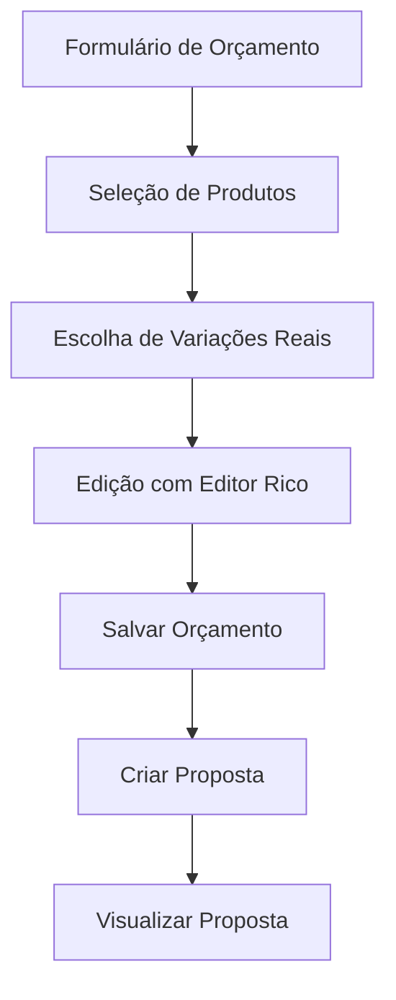

# Melhorias do Sistema de Orçamentos - Requisitos

## 1. Visão Geral do Produto

Sistema aprimorado de orçamentos com foco na simplificação do fluxo de trabalho, correção de problemas críticos na seleção de variações de produtos e implementação de editor de texto rico para melhor experiência do usuário. O sistema visa resolver três problemas principais: seleção incorreta de variações de produtos, complexidade desnecessária na estrutura de orçamentos e limitações na edição de conteúdo.

## 2. Funcionalidades Principais

### 2.1 Módulos de Funcionalidade

O sistema de melhorias consiste nas seguintes páginas principais:

1. **Formulário de Orçamento Aprimorado**: seleção precisa de variações, editor rico, estrutura simplificada
2. **Visualização de Proposta Otimizada**: fluxo simplificado de criação, numeração única
3. **Detalhes do Orçamento Reformulado**: gestão individual de orçamentos, propostas autônomas

### 2.2 Detalhes das Páginas

| Nome da Página | Nome do Módulo | Descrição da Funcionalidade |
|----------------|----------------|------------------------------|
| Formulário de Orçamento | Seleção de Variações | Exibir apenas variações reais disponíveis do produto baseadas nos dados de `variacoes`, `cores`, `color_options` |
| Formulário de Orçamento | Editor de Texto Rico | Substituir textarea por editor com formatação (negrito, itálico, listas, cores) |
| Formulário de Orçamento | Estrutura Simplificada | Remover complexidade de versões múltiplas, trabalhar com orçamentos únicos |
| Visualização de Proposta | Criação de Proposta | Corrigir erro no botão "Criar Proposta", implementar fluxo simplificado |
| Detalhes do Orçamento | Numeração Única | Cada orçamento possui número único e independente |
| Detalhes do Orçamento | Gestão de Propostas | Propostas autônomas vinculadas a orçamentos individuais |

## 3. Fluxo Principal do Processo

### Fluxo do Usuário Aprimorado:
1. **Criação de Orçamento**: Usuário acessa formulário simplificado com editor rico
2. **Seleção de Produtos**: Sistema exibe apenas variações reais disponíveis
3. **Edição de Conteúdo**: Editor rico permite formatação completa do texto
4. **Geração de Proposta**: Fluxo simplificado sem erros de criação
5. **Visualização**: Proposta gerada com numeração única e dados corretos

## 4. Design da Interface do Usuário

### 4.1 Estilo de Design

- **Cores Primárias**: Azul (#3B82F6) para ações principais, Verde (#10B981) para confirmações
- **Cores Secundárias**: Cinza (#6B7280) para textos, Vermelho (#EF4444) para alertas
- **Estilo de Botões**: Arredondados com hover suave e transições
- **Fontes**: Inter ou system fonts, tamanhos 12px-16px para conteúdo
- **Layout**: Design limpo com cards, navegação superior simplificada
- **Ícones**: Heroicons para consistência visual

### 4.2 Visão Geral do Design das Páginas

| Nome da Página | Nome do Módulo | Elementos da UI |
|----------------|----------------|-----------------|
| Formulário de Orçamento | Seleção de Variações | Select dropdown com opções dinâmicas baseadas em dados reais, preview de imagem atualizada |
| Formulário de Orçamento | Editor Rico | Toolbar com botões de formatação, área de edição WYSIWYG, preview em tempo real |
| Visualização de Proposta | Criação Simplificada | Botão "Criar Proposta" funcional, modal de confirmação, feedback visual |
| Detalhes do Orçamento | Numeração Única | Display do número único, status claro, ações simplificadas |

### 4.3 Responsividade

O sistema é desktop-first com adaptação mobile, otimizado para touch interaction no editor rico e seleção de variações.