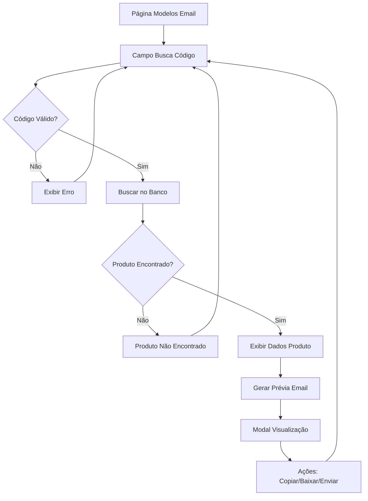

# Requisitos de Produto - Sistema de Prévia de Email por Código de Produto

## 1. Visão Geral do Produto

Sistema que permite aos consultores inserir um código de produto e visualizar automaticamente uma prévia do template de email de orçamento com os dados reais do produto encontrado no banco de dados. A funcionalidade integra-se ao sistema existente de modelos de email, proporcionando uma experiência intuitiva para testar e validar templates com produtos reais.

O sistema resolve o problema de validação manual de templates de email, permitindo que consultores vejam rapidamente como um produto específico será exibido no email enviado aos clientes, garantindo qualidade e precisão na comunicação comercial.

## 2. Funcionalidades Principais

### 2.1 Papéis de Usuário

| Papel | Método de Registro | Permissões Principais |
|-------|-------------------|----------------------|
| Consultor | Login com credenciais existentes | Pode buscar produtos por código, visualizar prévias de email, copiar código HTML |
| Administrador | Acesso administrativo | Todas as permissões do consultor + gerenciar templates |

### 2.2 Módulo de Funcionalidades

O sistema de prévia de email por código de produto consiste nas seguintes páginas principais:

1. **Página de Modelos de Email**: interface principal com busca por código de produto, visualização de prévia e gerenciamento de templates.
2. **Modal de Prévia**: exibição detalhada do email gerado com produto específico.
3. **Painel de Informações do Produto**: área que mostra os dados do produto encontrado.

### 2.3 Detalhes das Páginas

| Nome da Página | Nome do Módulo | Descrição da Funcionalidade |
|----------------|----------------|----------------------------|
| Modelos de Email | Campo de Busca por Código | Inserir código do produto e executar busca no banco de dados. Validar formato do código e exibir mensagens de erro apropriadas. |
| Modelos de Email | Painel de Produto Encontrado | Exibir informações do produto: título, descrição, categoria, código, imagem principal. Mostrar status de disponibilidade e dados técnicos. |
| Modelos de Email | Gerador de Prévia | Criar automaticamente template de email usando dados do produto encontrado. Aplicar formatação padrão de orçamento com produto real. |
| Modal de Prévia | Visualizador de Email | Renderizar HTML completo do email em iframe. Permitir visualização em modo responsivo e diferentes tamanhos de tela. |
| Modal de Prévia | Controles de Ação | Copiar código HTML, baixar template, enviar email de teste. Compartilhar prévia com outros usuários. |
| Painel de Informações | Detalhes Técnicos | Mostrar especificações completas: dimensões, peso, material, cores disponíveis. Exibir preços e opções de personalização. |

## 3. Processo Principal

### Fluxo do Consultor

1. **Acesso ao Sistema**: Consultor acessa a página de Modelos de Email através do menu principal
2. **Busca por Produto**: Insere código do produto no campo de busca dedicado
3. **Validação**: Sistema valida formato do código e busca no banco de dados
4. **Exibição de Resultados**: Se produto encontrado, exibe informações detalhadas e gera prévia automaticamente
5. **Visualização da Prévia**: Consultor pode ver o email completo em diferentes modos (preview/código)
6. **Ações Disponíveis**: Copiar código, baixar template, ou enviar email de teste
7. **Nova Busca**: Repetir processo com outros códigos conforme necessário

## 4. Design da Interface do Usuário

### 4.1 Estilo de Design

- **Cores Primárias**: Azul (#3B82F6) para elementos principais, Cinza (#6B7280) para elementos secundários
- **Cores de Status**: Verde (#10B981) para sucesso, Vermelho (#EF4444) para erros, Amarelo (#F59E0B) para avisos
- **Estilo de Botões**: Arredondados com sombra sutil, efeito hover com mudança de opacidade
- **Tipografia**: Inter ou system fonts, tamanhos 14px para texto normal, 16px para títulos de seção
- **Layout**: Grid responsivo com sidebar para busca e área principal para prévia
- **Ícones**: Lucide React para consistência visual, estilo outline

### 4.2 Visão Geral do Design das Páginas

| Nome da Página | Nome do Módulo | Elementos da UI |
|----------------|----------------|-----------------|
| Modelos de Email | Campo de Busca | Input com ícone de lupa, placeholder "Digite o código do produto", botão "Buscar" azul, validação em tempo real com bordas coloridas |
| Modelos de Email | Card do Produto | Layout em card com imagem à esquerda, informações à direita, badge de categoria, código destacado, descrição truncada |
| Modelos de Email | Área de Prévia | Container com abas "Preview" e "Código", iframe para renderização, controles de zoom, botões de ação no topo |
| Modal de Prévia | Visualizador | Modal fullscreen com header fixo, área de conteúdo scrollável, botões de fechar e ações no footer |
| Painel Lateral | Lista de Produtos Recentes | Lista vertical com produtos buscados recentemente, click para recarregar prévia |

### 4.3 Responsividade

O sistema é projetado mobile-first com adaptação para desktop. Em dispositivos móveis, o layout muda para stack vertical com a busca no topo e prévia abaixo. Touch interactions são otimizadas para facilitar navegação em tablets e smartphones.