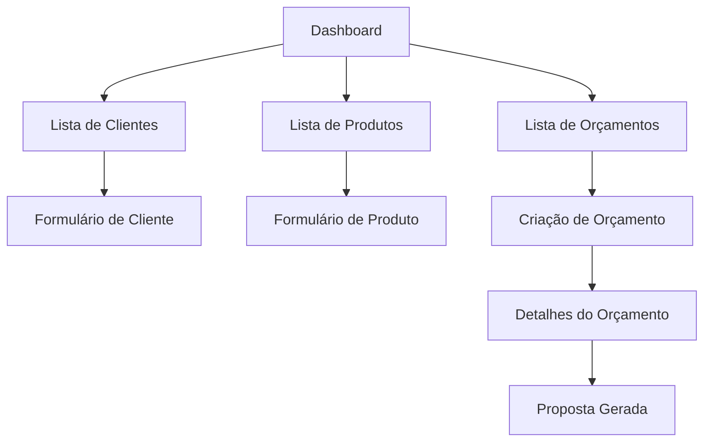

# Documento de Requisitos do Produto - Admin Brindes

## 1. Visão Geral do Produto

Painel administrativo para gestão completa de brindes ecológicos, permitindo controle de clientes, produtos e orçamentos.
Soluciona a necessidade de centralizar operações comerciais em uma interface moderna e eficiente para equipes de vendas.
O produto visa otimizar o processo de cotação e vendas de brindes personalizados, aumentando a produtividade da equipe comercial.

## 2. Funcionalidades Principais

### 2.1 Papéis de Usuário

| Papel | Método de Registro | Permissões Principais |
|-------|-------------------|----------------------|
| Administrador | Acesso direto ao sistema | Acesso completo a todos os módulos, configurações e relatórios |
| Vendedor | Cadastro pelo administrador | Gerenciar clientes, produtos e orçamentos de sua responsabilidade |

### 2.2 Módulos Funcionais

Nossos requisitos consistem nas seguintes páginas principais:
1. **Dashboard**: visão geral, estatísticas, atalhos rápidos.
2. **Lista de Clientes**: listagem, busca, paginação, ações CRUD.
3. **Formulário de Cliente**: cadastro/edição completa com dados básicos, endereço, contato e observações.
4. **Lista de Produtos**: listagem com imagens, busca, paginação, edição inline de custos.
5. **Formulário de Produto**: cadastro/edição com especificações técnicas e variações.
6. **Lista de Orçamentos**: listagem, busca, paginação, controle de status.
7. **Criação de Orçamento**: seleção de origem e cliente.
8. **Detalhes do Orçamento**: gestão completa de itens, versões, propostas e termos.

### 2.3 Detalhes das Páginas

| Nome da Página | Nome do Módulo | Descrição da Funcionalidade |
|----------------|----------------|-----------------------------|
| Dashboard | Visão Geral | Exibir estatísticas principais, orçamentos pendentes, atalhos para ações frequentes |
| Lista de Clientes | Listagem | Exibir tabela com ID, Nome, Email, Empresa, CNPJ, Fone, Ramo, Vendedor, Data, Status. Incluir busca por texto, paginação e ações editar/excluir |
| Formulário de Cliente | Cadastro/Edição | Gerenciar dados básicos (ativo, nome, empresa, razão social, IE, CNPJ, representante, ramo), endereço (CEP, logradouro, número, complemento, bairro, cidade, estado), contato (email, telefones) e observações |
| Lista de Produtos | Listagem | Exibir tabela com ID, Imagem, Referência, Nome, Fornecedor, Código Fornecedor, Custo editável inline, Tabela Fator editável inline, datas e status. Incluir busca e paginação |
| Formulário de Produto | Cadastro/Edição | Gerenciar referência, nome, fornecedor, código, status, descrição, categoria, cor principal, imagens, dimensões físicas, peso, custo, tabela fator e lista dinâmica de variações |
| Lista de Orçamentos | Listagem | Exibir tabela com ID, Data, Empresa, Contato, Representante, Status, Origem, Envio Proposta, Proposta. Incluir busca e paginação |
| Criação de Orçamento | Novo Orçamento | Permitir seleção de origem (Telefone, Email, etc.), busca e seleção de cliente, continuação para detalhes |
| Detalhes do Orçamento | Gestão Completa | Gerenciar cabeçalho (status, representante, cliente), adicionar produtos por referência, grade de itens com personalização, versões numeradas, termos comerciais e geração de propostas |

## 3. Processo Principal

**Fluxo do Administrador:**
1. Acessa dashboard com visão geral do sistema
2. Gerencia cadastro de clientes e produtos
3. Acompanha orçamentos e propostas em andamento
4. Configura parâmetros do sistema

**Fluxo do Vendedor:**
1. Acessa dashboard personalizado
2. Cria novo orçamento selecionando origem e cliente
3. Adiciona produtos ao orçamento com personalização
4. Define termos comerciais e gera proposta
5. Envia proposta ao cliente e acompanha status
6. Clona versões para ajustes quando necessário

## 4. Design da Interface do Usuário

### 4.1 Estilo de Design

- **Cores primárias e secundárias**: Azul (#3B82F6) como cor principal, cinza (#6B7280) como secundária, verde (#10B981) para status positivos, vermelho (#EF4444) para alertas
- **Estilo de botões**: Botões arredondados com cantos suaves, estilo moderno flat design
- **Fonte e tamanhos preferenciais**: Inter ou system fonts, tamanhos 14px para texto base, 16px para labels, 12px para texto auxiliar
- **Estilo de layout**: Layout baseado em cards com navegação superior, sidebar opcional, design limpo e espaçado
- **Sugestões para emojis ou ícones**: Ícones Heroicons, emojis para status (✅ ativo, ❌ inativo, 📧 email, 📱 telefone)

### 4.2 Visão Geral do Design das Páginas

| Nome da Página | Nome do Módulo | Elementos da UI |
|----------------|----------------|----------------|
| Dashboard | Visão Geral | Cards com estatísticas, gráficos simples, lista de ações recentes, cores suaves com destaque em azul |
| Lista de Clientes | Listagem | Breadcrumb HOME, título "Lista de Clientes", campo de busca, botão "+ Incluir Novo" azul, tabela responsiva com zebra striping, paginação inferior |
| Formulário de Cliente | Cadastro/Edição | Breadcrumb, título, abas (Dados, CRM, Departamentos), seções em cards com campos organizados em grid, botões de ação no topo |
| Lista de Produtos | Listagem | Layout similar aos clientes, coluna de imagem com thumbnails 40x40px, campos editáveis inline com ícone 💾, status com badges coloridos |
| Formulário de Produto | Cadastro/Edição | Seções organizadas em cards, upload de imagens com preview, lista dinâmica de variações com botões adicionar/remover |
| Lista de Orçamentos | Listagem | Colunas com status coloridos, datas formatadas pt-BR, números de proposta destacados, ações contextuais |
| Detalhes do Orçamento | Gestão Completa | Layout em seções: cabeçalho, itens em tabela editável, versões em tabs, termos em formulário, botão CTA "Criar Proposta" destacado |

### 4.3 Responsividade

O produto é desktop-first com adaptação para tablets, priorizando a experiência em telas grandes para produtividade. Inclui otimização para touch em dispositivos móveis com botões e campos de tamanho adequado.