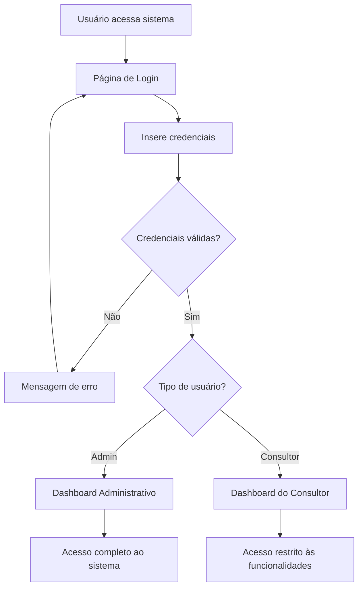
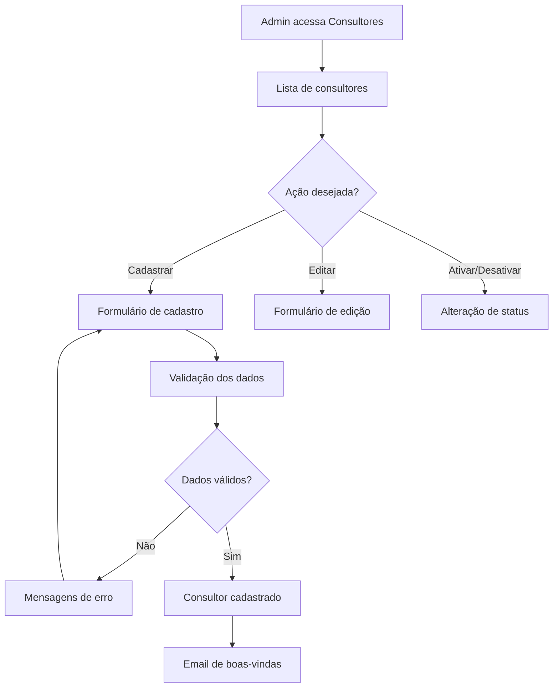
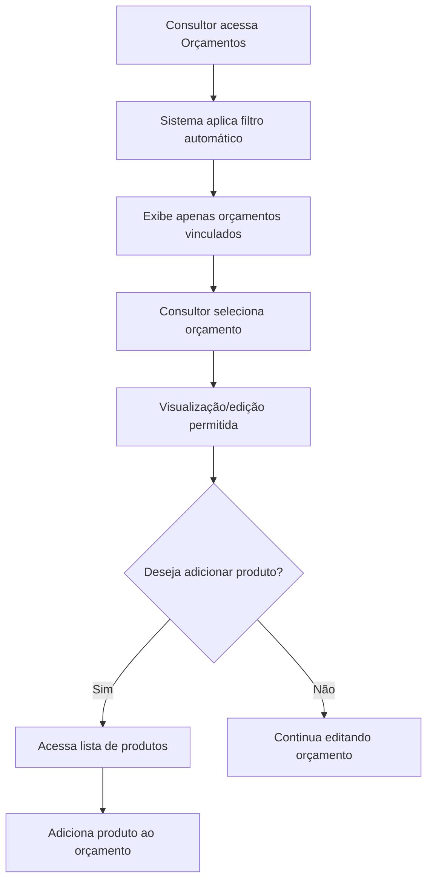

# Sistema de Consultores - Requisitos do Produto

## 1. Visão Geral do Produto

O Sistema de Consultores é uma extensão do NB Admin que permite o cadastro e gerenciamento de consultores com acesso controlado ao sistema. Cada consultor terá acesso restrito apenas aos orçamentos vinculados a ele e permissões limitadas para adicionar produtos, garantindo segurança e organização no fluxo de trabalho.

- **Objetivo Principal**: Permitir que consultores acessem o sistema de forma segura e controlada
- **Público-Alvo**: Consultores de vendas e administradores do sistema
- **Valor do Produto**: Descentralização do acesso ao sistema mantendo controle e segurança

## 2. Funcionalidades Principais

### 2.1 Papéis de Usuário

| Papel | Método de Cadastro | Permissões Principais |
|-------|-------------------|----------------------|
| Administrador | Acesso direto ao sistema | Acesso completo: gerenciar consultores, clientes, produtos, orçamentos |
| Consultor | Cadastrado pelo administrador | Acesso restrito: visualizar orçamentos próprios, adicionar produtos |

### 2.2 Módulos do Sistema

O sistema de consultores será composto pelos seguintes módulos principais:

1. **Módulo de Autenticação**: login seguro, logout, recuperação de senha
2. **Módulo de Gestão de Consultores**: cadastro, edição, ativação/desativação
3. **Módulo de Controle de Acesso**: filtros por role, proteção de rotas
4. **Módulo de Dashboard**: visões personalizadas por tipo de usuário
5. **Módulo de Orçamentos Restritos**: acesso apenas a orçamentos vinculados
6. **Módulo de Produtos Limitados**: apenas adição de produtos

### 2.3 Detalhamento das Páginas

| Nome da Página | Módulo | Descrição das Funcionalidades |
|----------------|--------|-------------------------------|
| **Login** | Autenticação | Formulário de login com email e senha. Validação de credenciais. Redirecionamento baseado no papel do usuário. Mensagens de erro claras. |
| **Dashboard Admin** | Dashboard | Visão completa do sistema: estatísticas gerais, acesso a todos os módulos, gestão de consultores, relatórios administrativos. |
| **Dashboard Consultor** | Dashboard | Visão restrita: estatísticas pessoais, orçamentos vinculados, acesso limitado a funcionalidades permitidas. |
| **Gestão de Consultores** | Gestão | Lista de consultores cadastrados. Filtros por status (ativo/inativo). Busca por nome ou email. Ações: cadastrar, editar, ativar/desativar. |
| **Cadastro de Consultor** | Gestão | Formulário com campos: nome, email, telefone, senha inicial. Validação de email único. Definição de status inicial. |
| **Orçamentos (Admin)** | Orçamentos | Acesso a todos os orçamentos. Filtros avançados. Vinculação de orçamentos a consultores. Gestão completa. |
| **Orçamentos (Consultor)** | Orçamentos | Acesso apenas a orçamentos vinculados. Visualização e edição permitidas. Criação de novos orçamentos. |
| **Produtos (Admin)** | Produtos | Gestão completa: criar, editar, excluir, visualizar produtos. Controle de estoque. Categorização. |
| **Produtos (Consultor)** | Produtos | Visualização de produtos. Apenas adição a orçamentos. Botões de edição/exclusão ocultos. |

## 3. Fluxos Principais do Sistema

### 3.1 Fluxo de Autenticação

### 3.2 Fluxo de Gestão de Consultores (Admin)

### 3.3 Fluxo de Acesso a Orçamentos (Consultor)

## 4. Design da Interface

### 4.1 Estilo Visual

- **Cores Primárias**: Azul (#3B82F6) para elementos principais, Cinza (#6B7280) para textos secundários
- **Cores Secundárias**: Verde (#10B981) para ações positivas, Vermelho (#EF4444) para ações de exclusão
- **Tipografia**: Inter ou similar, tamanhos de 12px a 24px
- **Estilo de Botões**: Arredondados (border-radius: 6px), com estados hover e focus
- **Layout**: Design responsivo, sidebar para navegação, cards para conteúdo
- **Ícones**: Heroicons ou similar, consistentes em todo o sistema

### 4.2 Elementos da Interface

| Nome da Página | Módulo | Elementos da Interface |
|----------------|--------|------------------------|
| **Login** | Autenticação | **Estilo**: Página centralizada, fundo gradiente azul. **Layout**: Card central com logo, campos de entrada estilizados. **Cores**: Fundo azul (#3B82F6), card branco, botão azul. **Fontes**: Título 24px, labels 14px. **Animações**: Transições suaves nos campos. |
| **Dashboard Admin** | Dashboard | **Estilo**: Layout com sidebar e área principal. **Layout**: Grid de cards para estatísticas, tabelas para dados. **Cores**: Sidebar azul escuro, cards brancos com bordas cinza. **Fontes**: Títulos 18px, dados 16px. **Elementos**: Gráficos, tabelas, botões de ação. |
| **Dashboard Consultor** | Dashboard | **Estilo**: Layout simplificado, foco nos orçamentos. **Layout**: Cards maiores, menos informações. **Cores**: Tons mais suaves, destaque para orçamentos. **Fontes**: Títulos 16px, dados 14px. **Elementos**: Lista de orçamentos, estatísticas básicas. |
| **Gestão de Consultores** | Gestão | **Estilo**: Tabela responsiva com ações. **Layout**: Cabeçalho com filtros, tabela principal, paginação. **Cores**: Cabeçalho cinza claro, linhas alternadas. **Fontes**: Cabeçalho 14px bold, dados 14px. **Elementos**: Botões de ação, badges de status. |
| **Cadastro de Consultor** | Gestão | **Estilo**: Formulário em duas colunas. **Layout**: Campos organizados logicamente, botões no final. **Cores**: Labels cinza, campos com borda azul no focus. **Fontes**: Labels 14px, inputs 16px. **Elementos**: Validação em tempo real, mensagens de erro. |
| **Orçamentos (Consultor)** | Orçamentos | **Estilo**: Cards de orçamentos com informações essenciais. **Layout**: Grid responsivo, filtros simples. **Cores**: Cards brancos, status coloridos. **Fontes**: Título 16px, detalhes 14px. **Elementos**: Badges de status, botões de ação limitados. |
| **Produtos (Consultor)** | Produtos | **Estilo**: Lista de produtos com imagens. **Layout**: Grid de produtos, botão "Adicionar" destacado. **Cores**: Botões verdes para adicionar. **Fontes**: Nome 14px, preço 16px bold. **Elementos**: Imagens de produtos, botões de adição apenas. |

### 4.3 Responsividade

O sistema será **desktop-first** com adaptação para tablets e dispositivos móveis:

- **Desktop (1024px+)**: Layout completo com sidebar e múltiplas colunas
- **Tablet (768px-1023px)**: Sidebar colapsável, layout adaptado
- **Mobile (até 767px)**: Menu hambúrguer, layout em coluna única
- **Otimizações**: Touch-friendly para dispositivos móveis, botões maiores, espaçamento adequado

## 5. Requisitos de Segurança

### 5.1 Autenticação
- Login obrigatório para acesso ao sistema
- Senhas com critérios mínimos: 8 caracteres, letras e números
- Hash seguro de senhas no banco de dados
- Sessões com timeout automático
- Logout seguro com limpeza de dados

### 5.2 Autorização
- Controle de acesso baseado em roles (admin/consultor)
- Filtros automáticos por consultor nos dados
- Proteção de rotas no frontend
- Validação de permissões no backend
- Row Level Security no banco de dados

### 5.3 Proteção de Dados
- Validação e sanitização de todos os inputs
- Prevenção de SQL injection
- Proteção contra XSS
- Logs de auditoria para ações críticas
- Backup automático dos dados

## 6. Requisitos de Performance

### 6.1 Tempo de Resposta
- Login: máximo 2 segundos
- Carregamento de páginas: máximo 3 segundos
- Consultas de dados: máximo 1 segundo
- Operações de CRUD: máximo 2 segundos

### 6.2 Escalabilidade
- Suporte a até 100 consultores simultâneos
- Banco de dados otimizado com índices
- Cache de dados frequentemente acessados
- Paginação em listas grandes

## 7. Requisitos de Usabilidade

### 7.1 Facilidade de Uso
- Interface intuitiva e familiar
- Navegação clara e consistente
- Mensagens de feedback claras
- Formulários com validação em tempo real
- Atalhos de teclado para ações comuns

### 7.2 Acessibilidade
- Contraste adequado de cores
- Suporte a leitores de tela
- Navegação por teclado
- Textos alternativos em imagens
- Tamanhos de fonte ajustáveis

## 8. Critérios de Aceitação

### 8.1 Funcionalidades Obrigatórias
- ✅ Sistema de login funcional
- ✅ Cadastro de consultores pelo admin
- ✅ Controle de acesso por roles
- ✅ Filtro automático de orçamentos por consultor
- ✅ Restrição de consultores a apenas adicionar produtos
- ✅ Dashboard personalizado por tipo de usuário
- ✅ Logout seguro

### 8.2 Validações de Segurança
- ✅ Tentativa de acesso a dados não autorizados deve ser bloqueada
- ✅ Senhas devem ser armazenadas com hash seguro
- ✅ Sessões devem expirar automaticamente
- ✅ Logs de auditoria devem ser gerados

### 8.3 Testes de Usabilidade
- ✅ Consultor consegue fazer login em menos de 30 segundos
- ✅ Admin consegue cadastrar novo consultor em menos de 2 minutos
- ✅ Consultor encontra seus orçamentos facilmente
- ✅ Interface é responsiva em diferentes dispositivos

Este documento define todos os requisitos necessários para implementar um sistema de consultores seguro, funcional e fácil de usar no NB Admin.