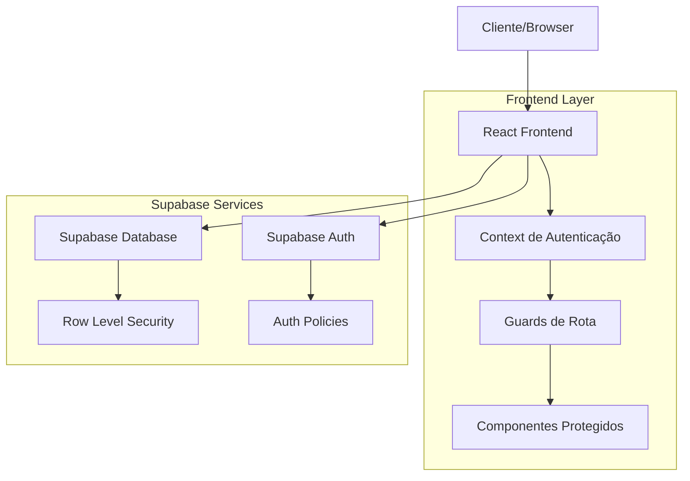
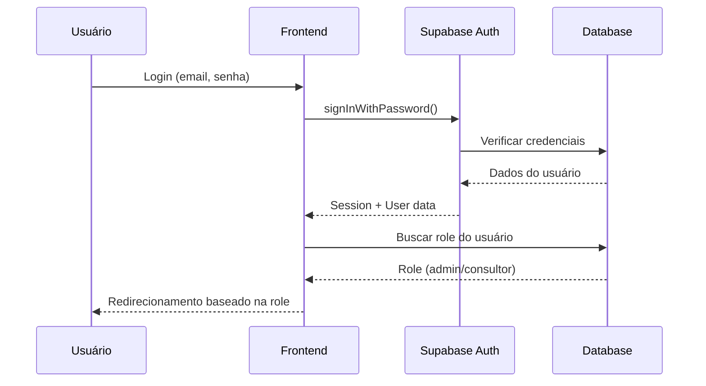
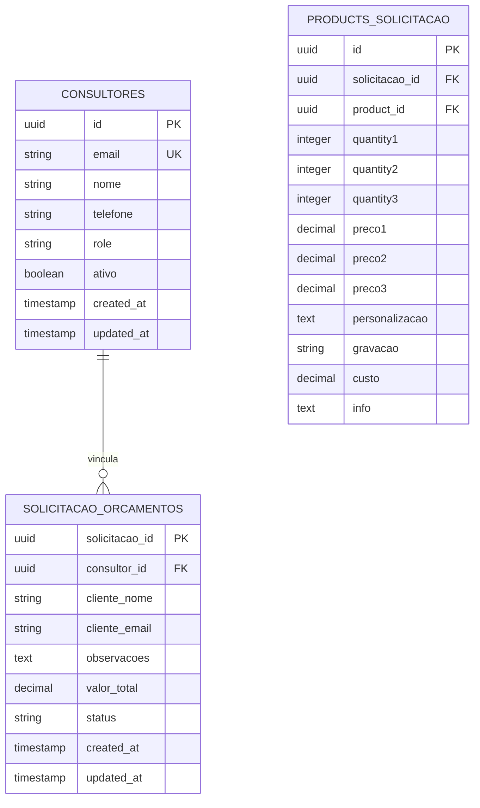
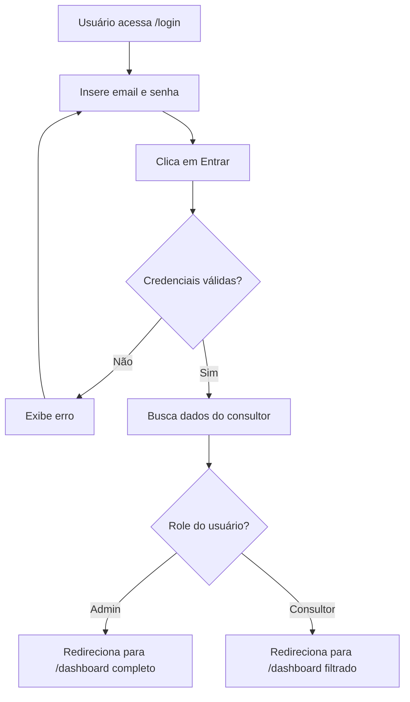
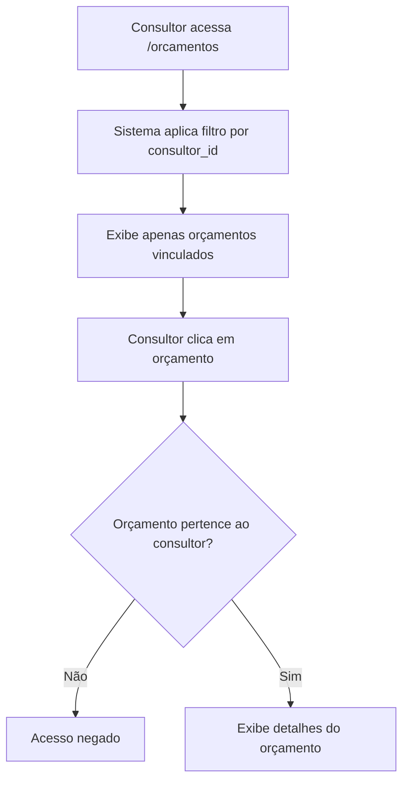

# Sistema de Consultores - Especificação Técnica

## 1. Visão Geral do Sistema

Este documento especifica a implementação de um sistema completo de cadastro e autenticação de consultores para o NB Admin, incluindo controle de acesso baseado em roles, autenticação segura e restrições de permissões específicas.

### 1.1 Objetivos
- Implementar cadastro e autenticação de consultores
- Estabelecer controle de acesso baseado em roles (admin/consultor)
- Garantir que consultores acessem apenas orçamentos vinculados a eles
- Restringir consultores a apenas adicionar produtos
- Manter segurança e usabilidade do sistema

## 2. Arquitetura do Sistema

### 2.1 Diagrama de Arquitetura



### 2.2 Fluxo de Autenticação



## 3. Estrutura do Banco de Dados

### 3.1 Modelo de Dados



### 3.2 Scripts de Migração

#### Criação da Tabela Consultores
```sql
-- Migration: 004_create_consultores_table.sql
CREATE TABLE consultores (
    id UUID PRIMARY KEY DEFAULT gen_random_uuid(),
    email VARCHAR(255) UNIQUE NOT NULL,
    nome VARCHAR(255) NOT NULL,
    telefone VARCHAR(20),
    role VARCHAR(20) DEFAULT 'consultor' CHECK (role IN ('admin', 'consultor')),
    ativo BOOLEAN DEFAULT true,
    created_at TIMESTAMP WITH TIME ZONE DEFAULT NOW(),
    updated_at TIMESTAMP WITH TIME ZONE DEFAULT NOW()
);

-- Índices
CREATE INDEX idx_consultores_email ON consultores(email);
CREATE INDEX idx_consultores_role ON consultores(role);
CREATE INDEX idx_consultores_ativo ON consultores(ativo);

-- Trigger para updated_at
CREATE OR REPLACE FUNCTION update_updated_at_column()
RETURNS TRIGGER AS $$
BEGIN
    NEW.updated_at = NOW();
    RETURN NEW;
END;
$$ language 'plpgsql';

CREATE TRIGGER update_consultores_updated_at
    BEFORE UPDATE ON consultores
    FOR EACH ROW
    EXECUTE FUNCTION update_updated_at_column();
```

#### Atualização da Tabela Solicitação Orçamentos
```sql
-- Adicionar coluna consultor_id
ALTER TABLE solicitacao_orcamentos 
ADD COLUMN consultor_id UUID REFERENCES consultores(id);

-- Índice para consultor_id
CREATE INDEX idx_solicitacao_orcamentos_consultor_id 
ON solicitacao_orcamentos(consultor_id);
```

#### Configuração de Permissões (RLS)
```sql
-- Habilitar RLS na tabela consultores
ALTER TABLE consultores ENABLE ROW LEVEL SECURITY;

-- Política para admins (acesso total)
CREATE POLICY "Admins podem ver todos os consultores" ON consultores
    FOR ALL USING (
        EXISTS (
            SELECT 1 FROM consultores c 
            WHERE c.id = auth.uid() AND c.role = 'admin'
        )
    );

-- Política para consultores (apenas próprios dados)
CREATE POLICY "Consultores podem ver apenas próprios dados" ON consultores
    FOR SELECT USING (id = auth.uid());

-- RLS para solicitacao_orcamentos
ALTER TABLE solicitacao_orcamentos ENABLE ROW LEVEL SECURITY;

-- Política para admins
CREATE POLICY "Admins podem ver todos os orçamentos" ON solicitacao_orcamentos
    FOR ALL USING (
        EXISTS (
            SELECT 1 FROM consultores c 
            WHERE c.id = auth.uid() AND c.role = 'admin'
        )
    );

-- Política para consultores (apenas orçamentos vinculados)
CREATE POLICY "Consultores podem ver apenas orçamentos vinculados" ON solicitacao_orcamentos
    FOR SELECT USING (consultor_id = auth.uid());

-- Política para inserção (consultores podem criar orçamentos)
CREATE POLICY "Consultores podem criar orçamentos" ON solicitacao_orcamentos
    FOR INSERT WITH CHECK (consultor_id = auth.uid());

-- Política para atualização (consultores podem atualizar próprios orçamentos)
CREATE POLICY "Consultores podem atualizar próprios orçamentos" ON solicitacao_orcamentos
    FOR UPDATE USING (consultor_id = auth.uid());
```

## 4. Especificações de Frontend

### 4.1 Context de Autenticação

```typescript
// contexts/AuthContext.tsx
interface User {
  id: string;
  email: string;
  nome: string;
  role: 'admin' | 'consultor';
  ativo: boolean;
}

interface AuthContextType {
  user: User | null;
  loading: boolean;
  signIn: (email: string, password: string) => Promise<void>;
  signOut: () => Promise<void>;
  isAdmin: boolean;
  isConsultor: boolean;
}
```

### 4.2 Guards de Rota

```typescript
// components/ProtectedRoute.tsx
interface ProtectedRouteProps {
  children: React.ReactNode;
  requiredRole?: 'admin' | 'consultor';
  adminOnly?: boolean;
}

// Implementação de proteção baseada em roles
```

### 4.3 Estrutura de Rotas

| Rota | Acesso Admin | Acesso Consultor | Descrição |
|------|--------------|------------------|------------|
| `/login` | ✅ | ✅ | Página de login |
| `/dashboard` | ✅ | ✅ | Dashboard (dados filtrados por role) |
| `/consultores` | ✅ | ❌ | Gestão de consultores |
| `/consultores/novo` | ✅ | ❌ | Cadastro de consultor |
| `/clientes` | ✅ | ❌ | Gestão de clientes |
| `/produtos` | ✅ | ✅ (apenas adicionar) | Gestão de produtos |
| `/orcamentos` | ✅ | ✅ (filtrados) | Lista de orçamentos |
| `/orcamentos/novo` | ✅ | ✅ | Criar orçamento |
| `/orcamentos/:id` | ✅ | ✅ (se vinculado) | Detalhes do orçamento |

## 5. Componentes a Implementar

### 5.1 Páginas Administrativas
- `ConsultoresPage.tsx` - Lista de consultores
- `ConsultorForm.tsx` - Cadastro/edição de consultor
- `LoginPage.tsx` - Página de login

### 5.2 Componentes de Segurança
- `AuthContext.tsx` - Context de autenticação
- `ProtectedRoute.tsx` - Guard de rotas
- `RoleGuard.tsx` - Proteção baseada em roles

### 5.3 Hooks Personalizados
- `useAuth.ts` - Hook de autenticação
- `usePermissions.ts` - Hook de permissões

## 6. Fluxos de Usuário

### 6.1 Fluxo de Login



### 6.2 Fluxo de Acesso a Orçamentos (Consultor)



### 6.3 Fluxo de Adição de Produtos (Consultor)

```mermaid
flowchart TD
    A[Consultor acessa /produtos] --> B[Visualiza lista de produtos]
    B --> C[Clica em "Adicionar ao Orçamento"]
    C --> D[Produto é adicionado]
    D --> E[Botões de editar/excluir ficam ocultos]
```

## 7. Segurança

### 7.1 Autenticação
- Utilização do Supabase Auth para gerenciamento de sessões
- Hash automático de senhas pelo Supabase
- Tokens JWT para autenticação de API

### 7.2 Autorização
- Row Level Security (RLS) no banco de dados
- Guards de rota no frontend
- Validação de permissões em cada operação

### 7.3 Validações
- Email único no cadastro
- Senha com critérios mínimos de segurança
- Sanitização de inputs
- Prevenção de SQL injection (via Supabase)

## 8. Interface do Usuário

### 8.1 Página de Login
- Design limpo e profissional
- Campos: email, senha
- Botão "Entrar"
- Link "Esqueci minha senha" (futuro)
- Mensagens de erro claras

### 8.2 Dashboard do Consultor
- Visão simplificada focada em orçamentos
- Estatísticas pessoais
- Acesso rápido a funcionalidades permitidas

### 8.3 Gestão de Consultores (Admin)
- Lista com filtros e busca
- Formulário de cadastro/edição
- Ações: ativar/desativar, editar, visualizar

## 9. Implementação por Fases

### Fase 1: Estrutura Base
1. Criar migração da tabela consultores
2. Configurar RLS e políticas de segurança
3. Implementar AuthContext
4. Criar página de login

### Fase 2: Gestão de Consultores
1. Página de listagem de consultores
2. Formulário de cadastro
3. Integração com Supabase Auth

### Fase 3: Controle de Acesso
1. Implementar guards de rota
2. Filtrar dados por role
3. Restringir funcionalidades por permissão

### Fase 4: Testes e Refinamentos
1. Testes de segurança
2. Validação de fluxos
3. Ajustes de UX

## 10. Considerações Técnicas

### 10.1 Performance
- Índices otimizados nas tabelas
- Consultas eficientes com filtros por role
- Cache de dados de usuário

### 10.2 Escalabilidade
- Estrutura preparada para múltiplos consultores
- Políticas de RLS otimizadas
- Separação clara de responsabilidades

### 10.3 Manutenibilidade
- Código modular e reutilizável
- Documentação clara
- Padrões de desenvolvimento consistentes

Esta especificação fornece a base completa para implementar o sistema de consultores com segurança, usabilidade e escalabilidade adequadas para o NB Admin.