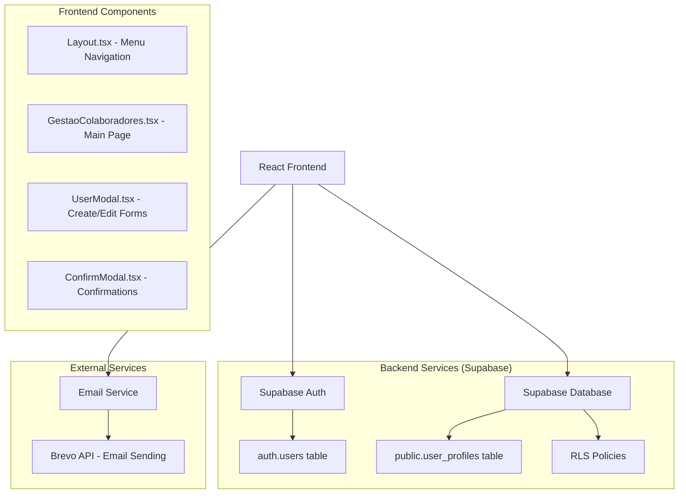
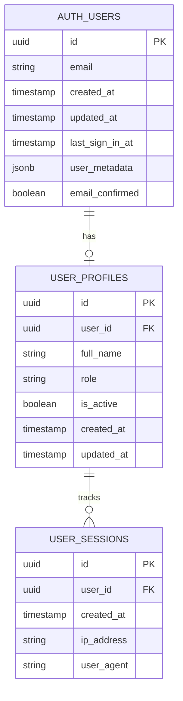

# Sistema de Gestão de Colaboradores - Arquitetura Técnica

## 1. Arquitetura do Sistema



## 2. Stack Tecnológica

* **Frontend**: React\@18 + TypeScript + Tailwind CSS + Vite

* **Backend**: Supabase (PostgreSQL + Auth + RLS)

* **Email**: Brevo API (integração existente)

* **Ícones**: Heroicons

* **Notificações**: React Hot Toast

## 3. Definição de Rotas

| Rota                             | Propósito                                                          |
| -------------------------------- | ------------------------------------------------------------------ |
| /gestao-colaboradores            | Página principal de gestão de usuários com tabela, filtros e ações |
| /gestao-colaboradores/novo       | Modal/página para criação de novo usuário                          |
| /gestao-colaboradores/editar/:id | Modal/página para edição de usuário existente                      |

## 4. APIs e Integrações

### 4.1 APIs do Supabase

**Gestão de Usuários**

```typescript
// Listar usuários com paginação
GET /rest/v1/auth/users?select=*&limit=20&offset=0

// Criar novo usuário
POST /auth/v1/admin/users
```

Request:

| Campo          | Tipo   | Obrigatório | Descrição                       |
| -------------- | ------ | ----------- | ------------------------------- |
| email          | string | true        | Email válido do usuário         |
| password       | string | true        | Senha temporária                |
| user\_metadata | object | false       | Dados adicionais (nome, perfil) |

Response:

| Campo       | Tipo      | Descrição           |
| ----------- | --------- | ------------------- |
| id          | uuid      | ID único do usuário |
| email       | string    | Email cadastrado    |
| created\_at | timestamp | Data de criação     |

**Atualização de Usuário**

```typescript
// Atualizar dados do usuário
PUT /auth/v1/admin/users/:id
```

**Redefinição de Senha**

```typescript
// Redefinir senha
POST /auth/v1/admin/users/:id/password
```

### 4.2 APIs de Email

**Envio de Credenciais**

```typescript
POST /api/email/send-credentials
```

Request:

| Campo    | Tipo   | Obrigatório | Descrição             |
| -------- | ------ | ----------- | --------------------- |
| to       | string | true        | Email do destinatário |
| name     | string | true        | Nome do usuário       |
| email    | string | true        | Email de login        |
| password | string | true        | Senha temporária      |

## 5. Modelo de Dados

### 5.1 Estrutura do Banco



### 5.2 DDL (Data Definition Language)

**Tabela de Perfis de Usuário**

```sql
-- Criar tabela de perfis
CREATE TABLE public.user_profiles (
    id UUID PRIMARY KEY DEFAULT gen_random_uuid(),
    user_id UUID REFERENCES auth.users(id) ON DELETE CASCADE,
    full_name VARCHAR(255) NOT NULL,
    role VARCHAR(50) DEFAULT 'consultor' CHECK (role IN ('super_admin', 'admin', 'consultor')),
    is_active BOOLEAN DEFAULT true,
    created_at TIMESTAMP WITH TIME ZONE DEFAULT NOW(),
    updated_at TIMESTAMP WITH TIME ZONE DEFAULT NOW()
);

-- Criar índices
CREATE INDEX idx_user_profiles_user_id ON public.user_profiles(user_id);
CREATE INDEX idx_user_profiles_role ON public.user_profiles(role);
CREATE INDEX idx_user_profiles_active ON public.user_profiles(is_active);

-- Trigger para updated_at
CREATE OR REPLACE FUNCTION update_updated_at_column()
RETURNS TRIGGER AS $$
BEGIN
    NEW.updated_at = NOW();
    RETURN NEW;
END;
$$ language 'plpgsql';

CREATE TRIGGER update_user_profiles_updated_at 
    BEFORE UPDATE ON public.user_profiles 
    FOR EACH ROW EXECUTE FUNCTION update_updated_at_column();

-- RLS Policies
ALTER TABLE public.user_profiles ENABLE ROW LEVEL SECURITY;

-- Policy para super_admin ver todos
CREATE POLICY "Super admins can view all profiles" ON public.user_profiles
    FOR SELECT USING (
        EXISTS (
            SELECT 1 FROM public.user_profiles up 
            WHERE up.user_id = auth.uid() 
            AND up.role = 'super_admin' 
            AND up.is_active = true
        )
    );

-- Policy para admin ver consultores
CREATE POLICY "Admins can view consultores" ON public.user_profiles
    FOR SELECT USING (
        EXISTS (
            SELECT 1 FROM public.user_profiles up 
            WHERE up.user_id = auth.uid() 
            AND up.role IN ('super_admin', 'admin') 
            AND up.is_active = true
        )
        AND (role = 'consultor' OR user_id = auth.uid())
    );

-- Policy para insert (apenas super_admin e admin)
CREATE POLICY "Admins can insert profiles" ON public.user_profiles
    FOR INSERT WITH CHECK (
        EXISTS (
            SELECT 1 FROM public.user_profiles up 
            WHERE up.user_id = auth.uid() 
            AND up.role IN ('super_admin', 'admin') 
            AND up.is_active = true
        )
    );

-- Policy para update (apenas super_admin e admin)
CREATE POLICY "Admins can update profiles" ON public.user_profiles
    FOR UPDATE USING (
        EXISTS (
            SELECT 1 FROM public.user_profiles up 
            WHERE up.user_id = auth.uid() 
            AND up.role IN ('super_admin', 'admin') 
            AND up.is_active = true
        )
    );

-- Dados iniciais
INSERT INTO public.user_profiles (user_id, full_name, role, is_active)
SELECT 
    id,
    COALESCE(user_metadata->>'full_name', 'Administrador'),
    'super_admin',
    true
FROM auth.users 
WHERE email = 'admin@naturezabrindes.com.br'
ON CONFLICT DO NOTHING;
```

**Tabela de Sessões (opcional para tracking)**

```sql
CREATE TABLE public.user_sessions (
    id UUID PRIMARY KEY DEFAULT gen_random_uuid(),
    user_id UUID REFERENCES auth.users(id) ON DELETE CASCADE,
    created_at TIMESTAMP WITH TIME ZONE DEFAULT NOW(),
    ip_address INET,
    user_agent TEXT
);

CREATE INDEX idx_user_sessions_user_id ON public.user_sessions(user_id);
CREATE INDEX idx_user_sessions_created_at ON public.user_sessions(created_at DESC);
```

## 6. Segurança e Permissões

### 6.1 Row Level Security (RLS)

* **Super Admin**: Acesso total a todos os usuários e operações

* **Admin**: Pode gerenciar apenas consultores, não pode alterar outros admins

* **Consultor**: Acesso apenas aos próprios dados

### 6.2 Validações Frontend

* Validação de email em tempo real

* Verificação de campos obrigatórios

* Confirmação para ações destrutivas

* Sanitização de inputs

### 6.3 Validações Backend

* Políticas RLS no Supabase

* Validação de roles válidos

* Verificação de permissões antes de operações críticas

