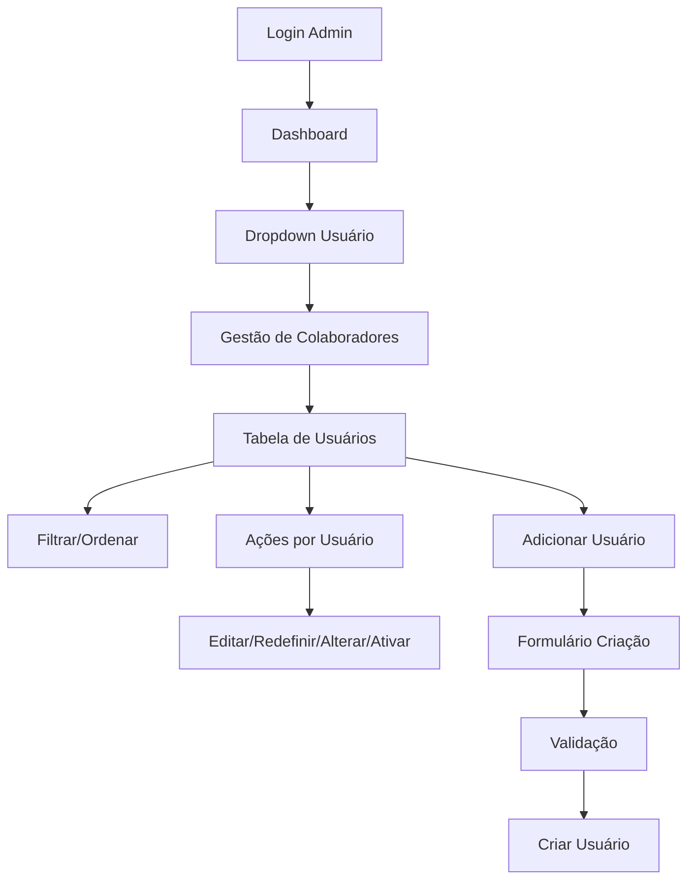

# Sistema de Gestão de Colaboradores - Requisitos

## 1. Visão Geral do Produto
Sistema integrado de gestão de colaboradores para o painel administrativo da Natureza Brindes, permitindo controle completo de usuários, perfis de acesso e permissões.

O sistema resolve a necessidade de gerenciar usuários administrativos e consultores de forma centralizada, oferecendo controle granular sobre acessos e funcionalidades.

## 2. Funcionalidades Principais

### 2.1 Perfis de Usuário
| Perfil | Método de Acesso | Permissões Principais |
|--------|------------------|----------------------|
| Super Admin | Acesso direto ao sistema | Controle total sobre usuários, pode criar/editar/desativar qualquer conta |
| Administrador | Criado por Super Admin | Pode gerenciar consultores e clientes, acesso limitado à gestão de usuários |
| Consultor | Criado por Admin | Acesso restrito aos próprios clientes e orçamentos |

### 2.2 Páginas do Sistema
O sistema de gestão de colaboradores consiste nas seguintes páginas principais:

1. **Página de Gestão de Colaboradores**: interface principal com tabela de usuários, filtros e controles de ação.
2. **Modal de Criação de Usuário**: formulário para adicionar novos colaboradores com validações.
3. **Modal de Edição de Usuário**: interface para modificar dados existentes de usuários.

### 2.3 Detalhes das Funcionalidades

| Página | Módulo | Descrição da Funcionalidade |
|--------|--------|----------------------------|
| Gestão de Colaboradores | Botão de Navegação | Adicionar opção "Gestão de Colaboradores" no menu dropdown do usuário logado |
| Gestão de Colaboradores | Tabela de Usuários | Exibir lista responsiva com nome completo, email, perfil, último acesso, status (ativo/inativo) |
| Gestão de Colaboradores | Sistema de Filtros | Implementar filtros por nome, email e perfil de acesso com busca em tempo real |
| Gestão de Colaboradores | Ordenação de Colunas | Permitir ordenação ascendente/descendente por qualquer coluna da tabela |
| Gestão de Colaboradores | Paginação | Dividir registros em páginas de 10-20 usuários com navegação intuitiva |
| Gestão de Colaboradores | Ações por Usuário | Botões para editar email, redefinir senha, alterar perfil, ativar/desativar conta |
| Modal de Criação | Formulário de Cadastro | Campos obrigatórios: nome completo, email válido, perfil de acesso |
| Modal de Criação | Validação de Dados | Verificar formato de email, unicidade, campos obrigatórios antes do cadastro |
| Modal de Criação | Envio de Credenciais | Opção para enviar credenciais de acesso por email automaticamente |
| Modal de Edição | Edição de Email | Permitir alteração de email com validação de formato e unicidade |
| Modal de Edição | Redefinição de Senha | Gerar nova senha temporária com confirmação e envio por email |
| Modal de Edição | Alteração de Perfil | Dropdown para modificar role do usuário (Admin, Consultor, etc.) |
| Sistema Geral | Confirmações | Modal de confirmação para todas as ações críticas (desativar, deletar, alterar perfil) |

## 3. Fluxos Principais

### Fluxo do Administrador
1. Acessa o sistema através do login
2. Clica no dropdown do usuário no canto superior direito
3. Seleciona "Gestão de Colaboradores"
4. Visualiza tabela com todos os usuários
5. Pode filtrar, ordenar e paginar os resultados
6. Para cada usuário pode: editar, redefinir senha, alterar perfil, ativar/desativar
7. Pode adicionar novos usuários através do botão "Adicionar Novo Usuário"

### Fluxo de Criação de Usuário
1. Clica em "Adicionar Novo Usuário"
2. Preenche formulário com dados obrigatórios
3. Seleciona perfil de acesso apropriado
4. Opcionalmente marca envio de credenciais por email
5. Sistema valida dados e cria usuário
6. Confirmação visual de sucesso/erro

## 4. Design da Interface

### 4.1 Estilo Visual
- **Cores Primárias**: Verde Natureza (#16a34a), Branco (#ffffff)
- **Cores Secundárias**: Cinza claro (#f3f4f6), Cinza escuro (#374151)
- **Botões**: Estilo arredondado com hover effects, verde para ações principais
- **Tipografia**: Inter ou system fonts, tamanhos 12px-18px
- **Layout**: Grid responsivo, cards com sombras sutis, espaçamento consistente
- **Ícones**: Heroicons outline, tamanho 16px-24px

### 4.2 Componentes da Interface

| Página | Módulo | Elementos de UI |
|--------|--------|-----------------|
| Gestão de Colaboradores | Header da Página | Título "Gestão de Colaboradores", breadcrumb, botão "Adicionar Novo Usuário" (verde, destacado) |
| Gestão de Colaboradores | Barra de Filtros | Inputs de busca por nome/email, dropdown de perfil, botão "Limpar Filtros" |
| Gestão de Colaboradores | Tabela Responsiva | Headers clicáveis para ordenação, linhas alternadas, badges coloridos para status e perfis |
| Gestão de Colaboradores | Ações por Linha | Dropdown com ícones: editar (lápis), redefinir senha (chave), alterar perfil (usuário), ativar/desativar (toggle) |
| Gestão de Colaboradores | Paginação | Números de página, setas de navegação, indicador "X de Y registros" |
| Modal de Criação | Formulário | Inputs com labels flutuantes, validação em tempo real, botões "Cancelar" e "Criar Usuário" |
| Modal de Edição | Formulário | Similar ao de criação, mas com dados pré-preenchidos e botão "Salvar Alterações" |
| Confirmações | Modal de Confirmação | Ícone de alerta, texto explicativo, botões "Cancelar" e "Confirmar" (vermelho para ações destrutivas) |

### 4.3 Responsividade
- **Desktop-first**: Interface otimizada para telas grandes (1024px+)
- **Tablet**: Adaptação para telas médias (768px-1023px) com tabela scrollável horizontalmente
- **Mobile**: Layout em cards empilhados para telas pequenas (<768px), filtros em accordion
- **Touch-friendly**: Botões e áreas clicáveis com tamanho mínimo de 44px